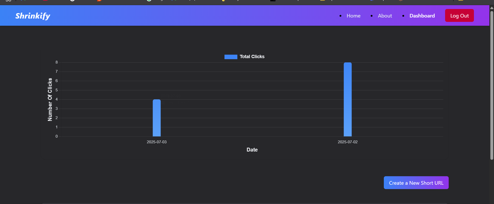
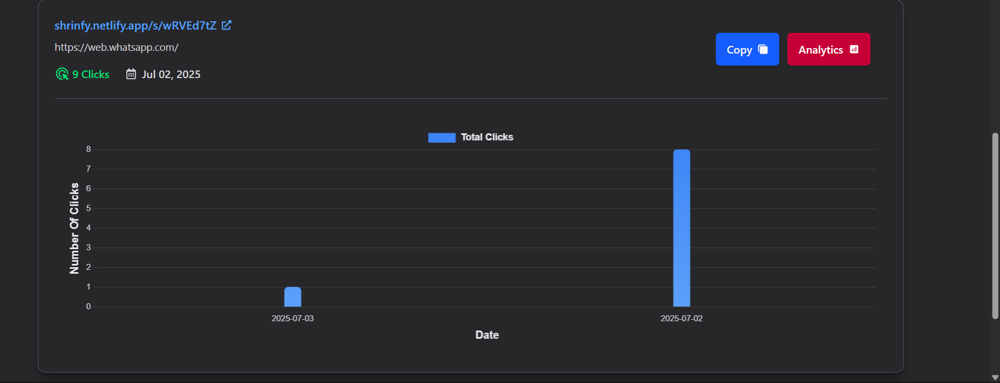

# 🚀 Shrinfy - URL Shortener with JWT Auth & Analytics

Shrinfy is a secure full-stack URL shortening platform.  
Built with **Spring Boot** (backend deployed on **Azure**) and **React + Tailwind CSS** frontend (on **Netlify**), it offers **JWT-protected APIs**, powerful analytics, and a responsive user interface.

---

## ✨ Features

- 🔐 **JWT Authentication** for secure login & registration.
- 🔗 **URL Shortening** with unique short codes.
- 📊 **Click Analytics**, view total clicks & detailed per-link stats.
- 🎨 **Responsive UI** with Tailwind CSS & interactive graphs (Chart.js).
- 🚀 **Deployed on Azure (backend) and Netlify (frontend)**.


## ⚙️ Tech Stack

| Technology   | Used For                      |
|--------------|------------------------------|
| Spring Boot  | Backend REST APIs, JWT Auth  |
| MySQL        | Persistent data storage      |
| React.js     | SPA Frontend                 |
| Tailwind CSS | Modern responsive UI         |
| Chart.js     | Click analytics charts       |
| Azure        | Deploying backend            |
| Netlify      | Deploying frontend           |


## 🚀 API Endpoints

Below are examples from your Postman collection:

---

### 🔐 Register a new user
```http
POST /api/auth/public/register
Content-Type: application/json

{
  "username": "sandeep",
  "email": "sandeep@megmail2.com",
  "password": "System@123"
}
```
**URL:**
```
http://localhost:8080net/api/auth/public/register
```

---

### 🔑 Login
```http
POST /api/auth/public/login
Content-Type: application/json

{
  "username": "sandeep singh2",
  "password": "System@123"
}
```
✅ Returns a **JWT token** to be used in `Authorization` header.

---

### ✂️ Shorten a URL
```http
POST /api/urls/shorten
Authorization: Bearer <JWT_TOKEN>
Content-Type: application/json

{
  "originalUrl": "https://example.com"
}
```
✅ Returns a JSON with your new short URL.

---

### 📊 Get your total click analytics
```http
GET /api/urls/myurls
Authorization: Bearer <JWT_TOKEN>
```

---

### 📈 Get analytics for a specific short URL
```http
GET /api/urls/analytics/{shortUrlCode}?startDate=2024-01-01T00:00:00&endDate=2024-01-31T23:59:59
Authorization: Bearer <JWT_TOKEN>
```

**Example:**
```
http://localhost:8080/api/urls/analytics/Pvtq3Oh4?startDate=2024-01-01T00:00:00&endDate=2024-01-31T23:59:59
```

---

## 🛠 Getting Started (Local Development)

### 🚀 Backend
```bash
cd backend
./mvnw spring-boot:run
```

### ⚛️ Frontend
```bash
cd frontend
npm install
npm run dev
```

---

## 🔒 Environment Variables

### 📌 Backend (`application.properties`)
```properties
spring.datasource.url=jdbc:mysql://localhost:3306/shrinfydb
spring.datasource.username=root
spring.datasource.password=yourpassword
jwt.secret=YourSecretKey
```

### 📌 Frontend (`.env`)
```bash
VITE_REACT_BACKEND_URL=https://your-backend.azure.com
```


## 🚀 Deployment

- ✅ **Frontend:** Netlify
- ✅ **Backend:** Azure App Service


## 📸 Screenshots
**Dashboard**





## 👤 Author

**Sunil Singh**  
💻 Passionate about building secure full-stack applications with Spring Boot, React, and cloud deployments.
